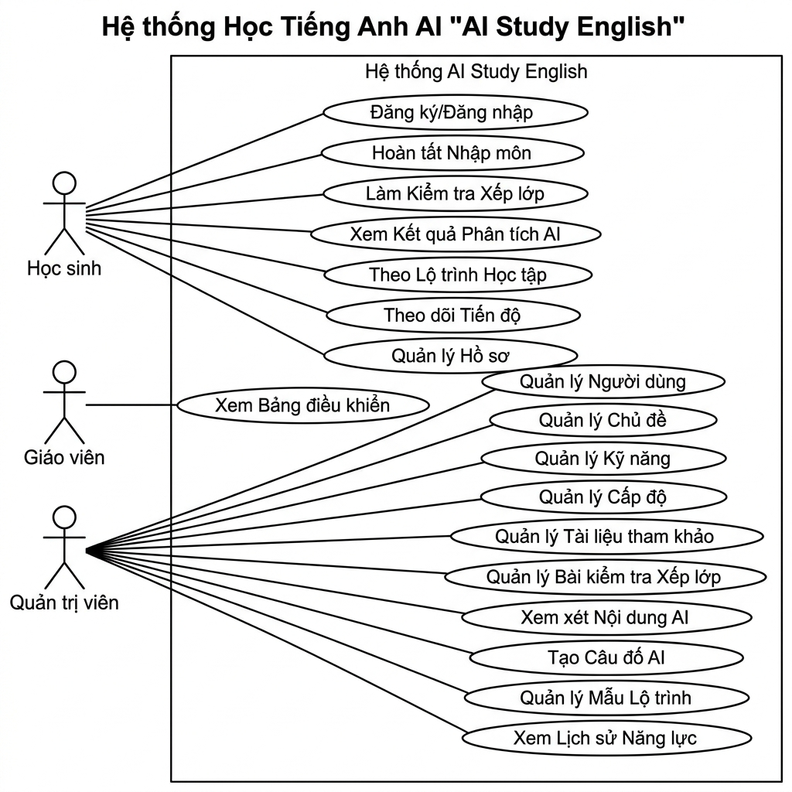
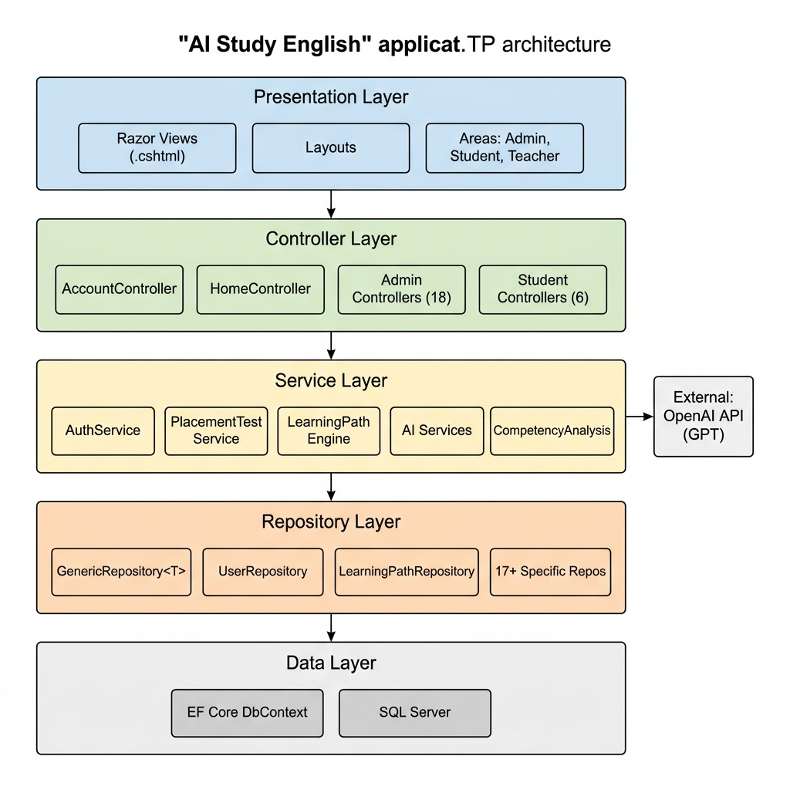
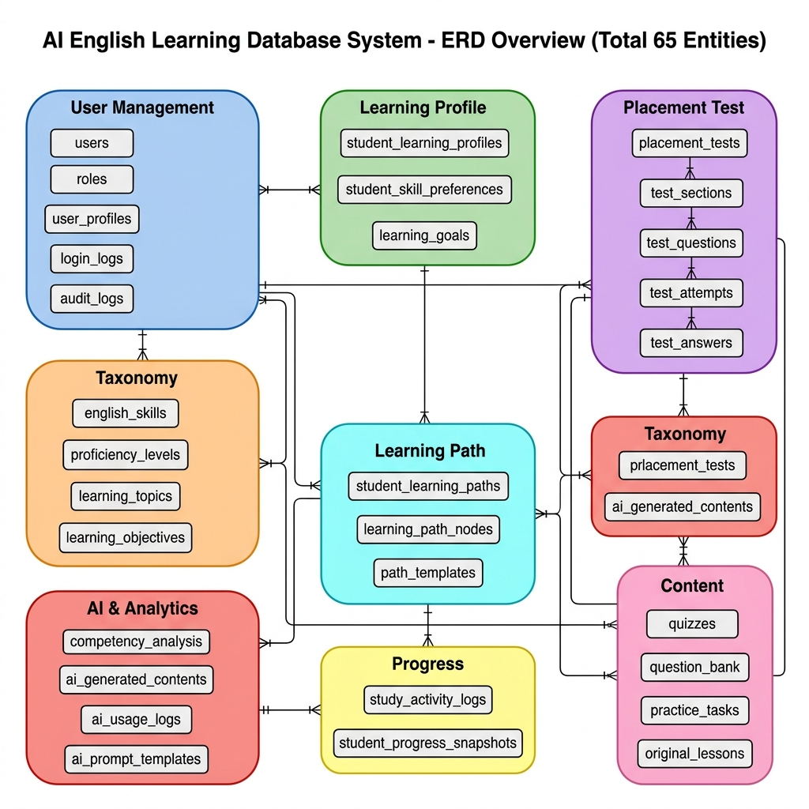
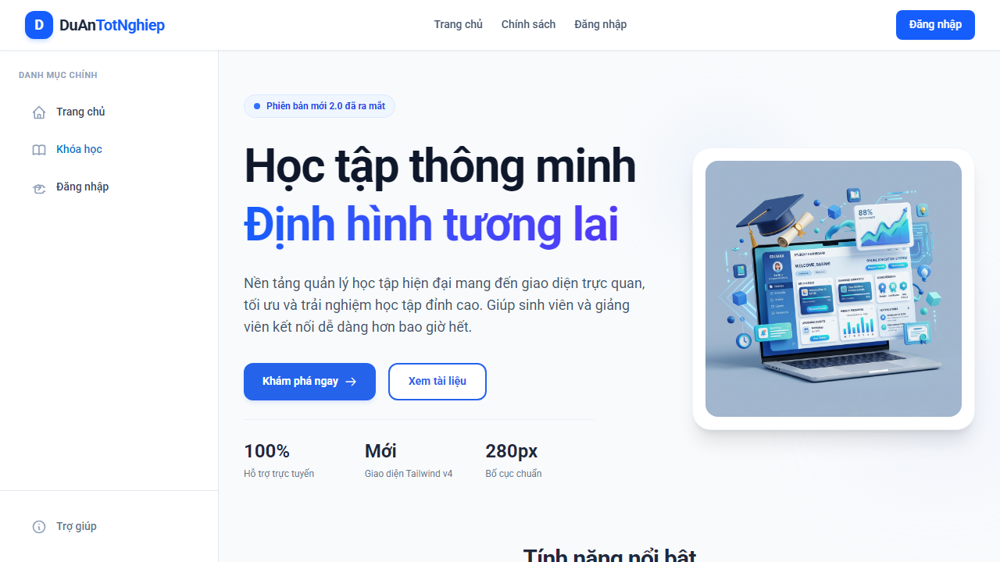
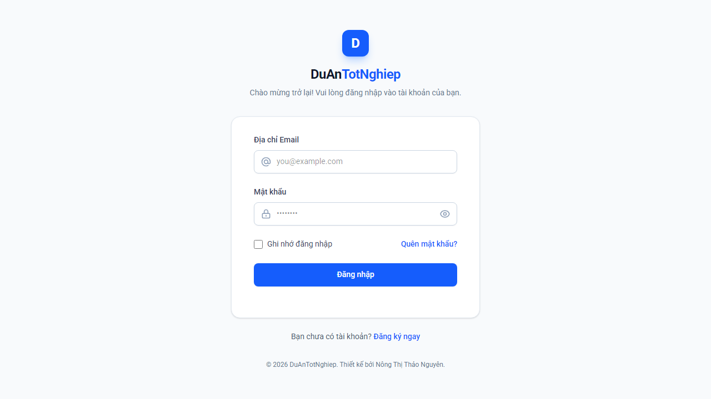
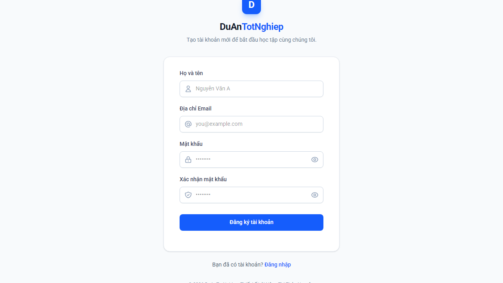

# TÀI LIỆU DỰ ÁN

## HỆ THỐNG HỌC TIẾNG ANH THÔNG MINH - AI STUDY ENGLISH


| | |
|:---|:---|
| Giảng viên | Hồ Hoàng Chương |
| Nhóm | 69 |
| Thành viên | Nông Thị Thảo Nguyên - TB01430 |
| | Ngô Gia Phú - TB01326 |
| | Trần Gia Nhật Ni - TB01392 |

---

## MỤC LỤC

1. [GIỚI THIỆU DỰ ÁN](#1-giới-thiệu-dự-án)
   - 1.1. Tổng quan dự án
   - 1.2. Yêu cầu hệ thống
   - 1.3. Kế hoạch dự án
2. [PHÂN TÍCH YÊU CẦU](#2-phân-tích-yêu-cầu)
   - 2.1. Sơ đồ Use Case
   - 2.2. Đặc tả yêu cầu hệ thống (SRS)
   - 2.3. Sơ đồ triển khai
3. [THIẾT KẾ ỨNG DỤNG](#3-thiết-kế-ứng-dụng)
   - 3.1. Mô hình công nghệ
   - 3.2. Kiến trúc hệ thống
   - 3.3. Thực thể – Sơ đồ quan hệ (ERD)
   - 3.4. Chi tiết thực thể
   - 3.5. Giao diện hệ thống
4. [THỰC HIỆN DỰ ÁN](#4-thực-hiện-dự-án)
   - 4.1. Cấu trúc thư mục dự án
   - 4.2. Cơ sở dữ liệu với SQL Server
   - 4.3. Lập trình tầng dữ liệu (Repository)
   - 4.4. Lập trình tầng nghiệp vụ (Service)
   - 4.5. Lập trình tầng điều khiển (Controller)
   - 4.6. Giao diện người dùng (Views)
   - 4.7. Tích hợp AI
5. [KIỂM THỬ PHẦN MỀM](#5-kiểm-thử-phần-mềm)
   - 5.1. Tổng quan kiểm thử
   - 5.2. Các Test Case chính
6. [KẾT LUẬN](#6-kết-luận)
   - 6.1. Kết quả đạt được
   - 6.2. Hạn chế
   - 6.3. Hướng phát triển

---

# 1. GIỚI THIỆU DỰ ÁN

## 1.1. Tổng quan dự án

Trong bối cảnh nhu cầu học tiếng Anh ngày càng tăng cao và công nghệ trí tuệ nhân tạo (AI) phát triển mạnh mẽ, việc ứng dụng AI vào giáo dục là xu hướng tất yếu. Hệ thống **AI Study English** được phát triển nhằm cung cấp một nền tảng học tiếng Anh cá nhân hóa, thông minh, giúp người học tự đánh giá trình độ, nhận lộ trình học tập phù hợp và theo dõi tiến trình học tập một cách hiệu quả.

Hệ thống được xây dựng trên nền tảng **ASP.NET Core MVC (.NET 10)** với cơ sở dữ liệu **SQL Server**, áp dụng kiến trúc phân tầng rõ ràng (Repository – Service – Controller – View). Dự án tích hợp **OpenAI API / Google Gemini API** để hỗ trợ phân tích năng lực, tạo nội dung bài kiểm tra tự động và xây dựng lộ trình học tập cá nhân hóa cho từng học viên.

Các chức năng chính của hệ thống bao gồm:

- **Quản lý tài khoản**: Đăng ký, đăng nhập, quên mật khẩu, xác thực OTP, quản lý hồ sơ cá nhân.

- **Onboarding (Khảo sát ban đầu)**: Thu thập thông tin mục tiêu học tập, trình độ hiện tại, kỹ năng ưu tiên và thời gian học khả dụng.

- **Bài kiểm tra xếp lớp (Placement Test)**: Đánh giá trình độ tiếng Anh qua các dạng câu hỏi trắc nghiệm, đúng/sai, tự luận ngắn, nghe hiểu.

- **Phân tích năng lực AI (Competency Analysis)**: AI phân tích kết quả bài kiểm tra, đánh giá điểm mạnh, điểm yếu và đưa ra nhận xét chi tiết.

- **Lộ trình học tập cá nhân hóa (Learning Path)**: AI tạo lộ trình học theo từng giai đoạn với các node bài học, bài kiểm tra, bài tập thực hành.

- **Theo dõi tiến trình học tập (Progress Tracking)**: Dashboard theo dõi tiến độ theo kỹ năng, chủ đề, lịch sử hoạt động.

- **AI Tutor**: Chatbot AI hỗ trợ học viên hỏi đáp về nội dung bài học 24/7.

- **Tạo câu hỏi tự động bằng AI (Quiz Generation)**: AI sinh câu hỏi theo chủ đề, trình độ, loại câu hỏi.

- **Gamification**: Hệ thống thành tích, huy hiệu, XP, streak và cấp bậc để tăng động lực học tập.

- **Kế hoạch học tập (Study Plan)**: Hiển thị kế hoạch học theo ngày/tuần/tháng dựa trên lộ trình cá nhân.

- **Quản trị hệ thống (Admin)**: Quản lý người dùng, chủ đề học tập, kỹ năng, trình độ, tài liệu tham khảo, bài kiểm tra xếp lớp, nội dung AI, lộ trình mẫu, thông báo, audit log, xuất dữ liệu.

- **Quản trị Giáo viên (Teacher)**: Dashboard, quản lý khóa học, bài học, quiz, bài tập, chấm điểm, điểm danh, lịch dạy, tài nguyên, tin nhắn, báo cáo, quản lý học viên.

- **Thông báo & Ghi chú**: Hệ thống thông báo cho học viên và ghi chú cá nhân.

## 1.2. Yêu cầu hệ thống

### 1.2.1. Yêu cầu chức năng

1. **Quản lý tài khoản người dùng**:
   - Đăng ký tài khoản với email, họ tên, mật khẩu (mã hóa BCrypt).
   - Đăng nhập với cơ chế khóa tài khoản sau nhiều lần thất bại.
   - Quên mật khẩu qua email OTP.
   - Quản lý hồ sơ cá nhân: đổi avatar, cập nhật thông tin, đổi mật khẩu.
   - Phân quyền theo vai trò: Admin, Teacher (Giáo viên), Student (Học viên).

2. **Khảo sát ban đầu (Onboarding)**:
   - Thu thập mục tiêu học tập, trình độ tự đánh giá, kỹ năng ưu tiên.
   - Thu thập thời gian học khả dụng (số phút/ngày, số ngày/tuần).
   - Xác nhận và lưu hồ sơ học tập (Learning Profile).

3. **Bài kiểm tra xếp lớp (Placement Test)**:
   - Quản lý bài kiểm tra gồm nhiều phần (Section), mỗi phần nhiều câu hỏi.
   - Hỗ trợ 4 dạng câu hỏi: MCQ, True/False, Short Answer, Listening.
   - Chấm điểm tự động, tổng hợp kết quả theo kỹ năng và trình độ.

4. **Phân tích năng lực AI**:
   - Gửi kết quả bài kiểm tra lên OpenAI/Gemini API để phân tích.
   - Tính điểm năng lực theo từng kỹ năng (Listening, Speaking, Reading, Writing, Grammar, Vocabulary).
   - Xác định điểm mạnh, điểm yếu và gợi ý cải thiện.
   - Chạy phân tích ở background (Background Service) để không chặn giao diện người dùng.

5. **Lộ trình học tập cá nhân hóa**:
   - AI tự động tạo lộ trình học gồm các node: Topic, Lesson, Quiz, Practice, Review, AI Tutor.
   - Quản lý trạng thái node: LOCKED → AVAILABLE → IN_PROGRESS → COMPLETED.
   - Tự động mở khóa node tiếp theo khi hoàn thành node trước đó.
   - Hỗ trợ xem chi tiết, tổng quan, lịch sử lộ trình.

6. **Theo dõi tiến trình học tập**:
   - Dashboard hiển thị tiến độ tổng quan, tiến độ theo kỹ năng, theo chủ đề.
   - Lịch sử hoạt động học tập chi tiết.
   - Snapshot tiến trình định kỳ (Background Service).

7. **AI Tutor**:
   - Chat trực tiếp với AI về nội dung bài học trong lộ trình.
   - Lưu lịch sử hội thoại theo conversation.
   - Hỗ trợ học viên 24/7.

8. **Tạo câu hỏi AI (Quiz Generation)**:
   - Chọn kỹ năng, chủ đề, trình độ, loại câu hỏi, số lượng.
   - AI sinh câu hỏi dạng JSON, lưu vào bảng ai_generated_contents.
   - Quy trình duyệt nội dung: PENDING → APPROVED/REJECTED → PUBLISHED.

9. **Gamification**:
   - Hệ thống XP (điểm kinh nghiệm), streak (chuỗi ngày học liên tục).
   - Huy hiệu thành tích khi đạt các cột mốc học tập.
   - Cấp bậc (Rank Tier) dựa trên XP tích lũy.

10. **Kế hoạch học tập (Study Plan)**:
    - Hiển thị kế hoạch học theo ngày/tuần/tháng dựa trên lộ trình cá nhân.

11. **Quản trị hệ thống (Admin)**:
    - CRUD đầy đủ cho: Kỹ năng tiếng Anh, Trình độ, Chủ đề học tập, Tài liệu tham khảo.
    - Quản lý bài kiểm tra xếp lớp, lịch sử làm bài.
    - Duyệt nội dung AI, xuất bản câu hỏi vào ngân hàng đề.
    - Xem lịch sử phân tích năng lực, audit log.
    - Import chủ đề từ file Excel.
    - Quản lý mẫu lộ trình học tập (Path Templates).
    - Quản lý thông báo hệ thống.
    - Quản lý thành tích (Achievements).
    - Xuất dữ liệu (Export).
    - Cài đặt hệ thống (System Settings).

12. **Quản trị Giáo viên (Teacher)**:
    - Dashboard tổng quan giáo viên.
    - Quản lý khóa học (Courses), bài học (Lessons).
    - Quản lý quiz và bài tập (Assignments).
    - Chấm điểm học viên (Grades).
    - Điểm danh (Attendance).
    - Quản lý lịch dạy (Schedule).
    - Quản lý tài nguyên học tập (Resources).
    - Gửi tin nhắn cho học viên (Messages).
    - Xem báo cáo (Reports).
    - Quản lý danh sách học viên (Students).

13. **Thông báo & Ghi chú**:
    - Hệ thống thông báo gửi đến học viên (toàn bộ hoặc cá nhân).
    - Ghi chú cá nhân của học viên.

### 1.2.2. Yêu cầu phi chức năng

- **Bảo mật**: Mật khẩu mã hóa BCrypt, Cookie Authentication với HttpOnly + Secure + SameSite Strict. Chống CSRF, IDOR prevention.

- **Hiệu năng**: Sử dụng AsNoTracking() cho các truy vấn đọc, Index cho các cột truy vấn thường xuyên. AI xử lý bất đồng bộ qua Background Service.

- **Khả năng mở rộng**: Kiến trúc phân tầng, Dependency Injection, Generic Repository Pattern. IAIProvider trừu tượng hóa cho phép swap OpenAI ↔ Gemini.

- **Giao diện**: Responsive, thân thiện, sử dụng Tailwind CSS v4, font Roboto.

- **Tích hợp AI**: Hỗ trợ cấu hình endpoint, model, API key qua file .env. Tự detect provider (OpenAI vs Gemini).

- **Ghi nhật ký**: Mọi lần gọi AI được log với token count, chi phí, thời gian, trạng thái. Audit log cho thao tác quản trị.

## 1.3. Kế hoạch dự án

| TT | Module | Mô tả | Trạng thái |
|---|---|---|---|
| M1 | Account & Auth | Đăng ký, đăng nhập, quên mật khẩu, hồ sơ cá nhân | ✅ Hoàn thành |
| M2 | Onboarding | Khảo sát ban đầu, tạo Learning Profile | ✅ Hoàn thành |
| M3 | Placement Test | Bài kiểm tra xếp lớp, chấm điểm tự động | ✅ Hoàn thành |
| M4 | Master Data | Chuẩn hóa CSDL, quản lý kỹ năng, trình độ, chủ đề | ✅ Hoàn thành |
| M5 | Reference Sources | Quản lý tài liệu tham khảo, kiểm tra bản quyền | ✅ Hoàn thành |
| M7 | Competency Analysis | Phân tích năng lực AI, tính điểm, nhận xét | ✅ Hoàn thành |
| M8 | Learning Path Engine | Tạo lộ trình AI, quản lý node, mẫu lộ trình | ✅ Hoàn thành |
| M9 | Learning Path UI | Giao diện lộ trình kiểu Duolingo, theo dõi tiến trình | ✅ Hoàn thành |
| M10 | Study Plan | Kế hoạch học theo ngày/tuần/tháng | ✅ Hoàn thành |
| M11 | AI Tutor | Chat với AI về nội dung bài học | ✅ Hoàn thành |
| M12 | Gamification | Thành tích, XP, streak, huy hiệu, cấp bậc | ✅ Hoàn thành |
| M13 | Teacher Module | Dashboard, khóa học, quiz, bài tập, chấm điểm, điểm danh | ✅ Hoàn thành |
| M14 | Quiz Generation | AI sinh câu hỏi, quy trình duyệt và xuất bản | ✅ Hoàn thành |
| M15 | Notifications & Notes | Thông báo hệ thống, ghi chú cá nhân | ✅ Hoàn thành |
| M16 | Progress Tracking | Dashboard tiến trình, lịch sử, snapshot | ✅ Hoàn thành |
| M17 | AI Replanning | Tái cấu trúc lộ trình học tập bằng AI | ✅ Hoàn thành |
| M18 | Export & Reporting | Xuất dữ liệu Excel, báo cáo | ✅ Hoàn thành |

---

# 2. PHÂN TÍCH YÊU CẦU

## 2.1. Sơ đồ Use Case

### 2.1.1. Use Case tổng quát

Hệ thống có **3 nhóm đối tượng (Actor)** chính:

| Actor | Mô tả |
|---|---|
| **Student (Học viên)** | Người dùng chính, đăng ký học, làm bài kiểm tra, theo dõi tiến trình, chat AI Tutor |
| **Teacher (Giáo viên)** | Quản lý khóa học, bài học, quiz, chấm điểm, điểm danh, lịch dạy |
| **Admin (Quản trị viên)** | Quản lý toàn bộ hệ thống, duyệt nội dung, quản lý người dùng |

**Các Use Case chính:**

- **UC01**: Đăng ký / Đăng nhập / Quên mật khẩu
- **UC02**: Hoàn thành Onboarding (khảo sát ban đầu)
- **UC03**: Làm bài kiểm tra xếp lớp (Placement Test)
- **UC04**: Xem kết quả phân tích năng lực AI
- **UC05**: Xem và theo dõi lộ trình học tập
- **UC06**: Theo dõi tiến trình học tập (Dashboard)
- **UC07**: Quản lý hồ sơ cá nhân
- **UC08**: Tương tác với AI Tutor
- **UC09**: Xem thành tích và huy hiệu (Gamification)
- **UC10**: Xem kế hoạch học tập (Study Plan)
- **UC11**: Quản lý ghi chú cá nhân
- **UC12**: Quản lý người dùng (Admin)
- **UC13**: Quản lý chủ đề học tập (Admin)
- **UC14**: Quản lý kỹ năng tiếng Anh (Admin)
- **UC15**: Quản lý trình độ (Admin)
- **UC16**: Quản lý tài liệu tham khảo (Admin)
- **UC17**: Quản lý bài kiểm tra xếp lớp (Admin)
- **UC18**: Duyệt và xuất bản nội dung AI (Admin)
- **UC19**: Tạo câu hỏi tự động bằng AI
- **UC20**: Quản lý mẫu lộ trình học tập (Admin)
- **UC21**: Quản lý thông báo (Admin)
- **UC22**: Xem audit log (Admin)
- **UC23**: Xuất dữ liệu (Admin)
- **UC24**: Quản lý khóa học (Teacher)
- **UC25**: Quản lý bài học & Quiz (Teacher)
- **UC26**: Chấm điểm & Điểm danh (Teacher)
- **UC27**: Quản lý lịch dạy (Teacher)

*(Sơ đồ Use Case tổng quát)*



## 2.2. Đặc tả yêu cầu hệ thống (SRS)

### 2.2.1. Quản lý tài khoản (Account)

- **Mô tả**: Cho phép người dùng đăng ký, đăng nhập, đăng xuất, quên mật khẩu và quản lý thông tin cá nhân.
- **Dữ liệu liên quan**: Email, PasswordHash, FullName, AvatarUrl, Phone, RoleId, Status, LastLoginAt, FailedLoginCount, LockoutUntil, CreatedAt, UpdatedAt.
- **Đối tượng sử dụng**: Tất cả người dùng.
- **Nghiệp vụ đặc biệt**:
  - Mật khẩu được mã hóa bằng BCrypt.
  - Tài khoản bị khóa sau 5 lần đăng nhập sai (LockoutUntil).
  - Quên mật khẩu qua OTP gửi email (bảng password_reset_tokens).

### 2.2.2. Khảo sát ban đầu (Onboarding)

- **Mô tả**: Thu thập thông tin mục tiêu, trình độ, kỹ năng ưu tiên, thời gian học của học viên. Bắt buộc hoàn thành trước khi sử dụng các tính năng khác.
- **Dữ liệu liên quan**: CurrentLevel, TargetLevel, LearningGoal, DailyStudyMinutes, WeeklyStudyDays, SkillPreferences.
- **Đối tượng sử dụng**: Student.
- **Giao diện**: Dạng bước (Stepper) gồm 6 bước: Start → Level → Skills → Goal → StudyTime → Confirm.

### 2.2.3. Bài kiểm tra xếp lớp (Placement Test)

- **Mô tả**: Bài kiểm tra đánh giá trình độ tiếng Anh, gồm nhiều phần (Section), mỗi phần nhiều câu hỏi với các dạng khác nhau.
- **Dữ liệu liên quan**:
  - PlacementTest: Title, Description, TimeLimit, PassScore, Status.
  - PlacementTestSection: Title, SkillId, OrderIndex, TotalQuestions.
  - PlacementTestQuestion: QuestionText, QuestionType (MCQ/TRUE_FALSE/SHORT_ANSWER/LISTENING), Options, CorrectAnswer, Points.
  - TestAttempt: UserId, Score, TimeTaken, Status.
  - TestAnswer: AttemptId, QuestionId, SelectedAnswer, IsCorrect, Points.
- **Đối tượng sử dụng**: Student (làm bài), Admin (quản lý bài kiểm tra).
- **Nghiệp vụ đặc biệt**: Bắt buộc hoàn thành sau Onboarding, trước khi truy cập các tính năng học tập.

### 2.2.4. Phân tích năng lực AI (Competency Analysis)

- **Mô tả**: Sử dụng AI (OpenAI/Gemini) để phân tích kết quả bài kiểm tra xếp lớp, đánh giá điểm số theo từng kỹ năng, xác định điểm mạnh/yếu.
- **Dữ liệu liên quan**:
  - CompetencyAnalysis: UserId, TestAttemptId, OverallScore, OverallLevel, AiModelUsed, AiFeedbackSummary, AnalysisVersion, Status.
  - CompetencySkillScore: AnalysisId, SkillId, Score, Level, AiFeedback.
- **Đối tượng sử dụng**: Student (xem kết quả), Admin (xem lịch sử).
- **Nghiệp vụ đặc biệt**: Phân tích chạy ở Background Service để không chặn UI.

### 2.2.5. Quản lý chủ đề học tập (Learning Topics)

- **Mô tả**: Quản lý cây chủ đề học tập đa cấp, gắn với kỹ năng và trình độ. Hỗ trợ import từ Excel.
- **Dữ liệu liên quan**: Title, Slug, Description, SkillId, ProficiencyLevelId, ParentTopicId, OrderIndex, IsActive, Difficulty, EstimatedMinutes, IconClass, CreatedById.
- **Đối tượng sử dụng**: Admin.
- **Giao diện**: Dạng bảng danh sách + dạng cây (Tree View).

### 2.2.6. Quản lý kỹ năng tiếng Anh (English Skills)

- **Mô tả**: CRUD các kỹ năng tiếng Anh: Listening, Speaking, Reading, Writing, Grammar, Vocabulary.
- **Dữ liệu liên quan**: Name, Slug, Description, IconClass, ColorHex, DisplayOrder, IsActive, CefrMapping.
- **Đối tượng sử dụng**: Admin.

### 2.2.7. Quản lý trình độ (English Proficiency Levels)

- **Mô tả**: CRUD các cấp độ tiếng Anh theo chuẩn CEFR (A1 → C2).
- **Dữ liệu liên quan**: Code, Name, Description, OrderIndex, MinScore, MaxScore, IsActive, CefrLevel, ColorHex, IconClass.
- **Đối tượng sử dụng**: Admin.

### 2.2.8. Quản lý tài liệu tham khảo (Reference Sources)

- **Mô tả**: Quản lý nguồn tài liệu gắn với chủ đề, bao gồm kiểm tra bản quyền, quy trình duyệt.
- **Dữ liệu liên quan**: Title, SourceType (TEXTBOOK/WEBSITE/VIDEO/AUDIO/RESEARCH_PAPER), Url, Author, Publisher, LicenseType, IsVerified, ApprovalStatus.
- **Đối tượng sử dụng**: Admin (tạo, duyệt).

### 2.2.9. Lộ trình học tập (Learning Path)

- **Mô tả**: AI tạo lộ trình học cá nhân hóa gồm các giai đoạn (Phase) và các node (bài học, bài kiểm tra, bài tập).
- **Dữ liệu liên quan**:
  - StudentLearningPath: StudentId, Title, Status, StartDate, TargetEndDate, AiPlanSummary, GeneratedByAi, PathVersion.
  - LearningPathNode: LearningPathId, TopicId, LessonId, QuizId, PracticeTaskId, NodeTitle, NodeType (TOPIC/LESSON/QUIZ/PRACTICE/REVIEW/AI_TUTOR), PathPhase, ScheduledDate, EstimatedMinutes, OrderIndex, Status (LOCKED/AVAILABLE/IN_PROGRESS/COMPLETED/NEED_REVIEW/SKIPPED), AiReason, CompletedAt, RequiredNodeId.
- **Đối tượng sử dụng**: Student (xem, học), Admin (quản lý mẫu, xem lịch sử).
- **Nghiệp vụ đặc biệt**: Tự động mở khóa node tiếp theo khi hoàn thành node hiện tại.

### 2.2.10. Theo dõi tiến trình (Progress Tracking)

- **Mô tả**: Dashboard tổng quan, tiến trình theo kỹ năng, chủ đề, lịch sử hoạt động.
- **Dữ liệu liên quan**:
  - StudyActivityLog: StudentId, ActivityType, TopicId, LearningPathNodeId, DurationMinutes, Score, Metadata, CreatedAt.
  - StudentProgressSnapshot: UserId, SnapshotDate, OverallScore, SkillScoresJson, TopicProgressJson.
- **Đối tượng sử dụng**: Student.

### 2.2.11. AI Tutor

- **Mô tả**: Chatbot AI hỗ trợ học viên hỏi đáp về nội dung bài học trong lộ trình.
- **Dữ liệu liên quan**:
  - AiTutorConversation: StudentId, Title, CreatedAt.
  - AiTutorMessage: ConversationId, Role (user/assistant), Content, CreatedAt.
- **Đối tượng sử dụng**: Student.

### 2.2.12. Tạo câu hỏi AI (Quiz Generation)

- **Mô tả**: Sử dụng AI để tự động sinh câu hỏi theo chủ đề, trình độ, loại câu hỏi. Có quy trình duyệt nội dung trước khi xuất bản.
- **Dữ liệu liên quan**:
  - AiGeneratedContent: ContentType, GeneratedContent, ReviewStatus (PENDING/APPROVED/REJECTED), TopicId, SkillId, ProficiencyLevelId, BatchId.
  - AiUsageLog: Action, InputTokens, OutputTokens, Cost, Status, AiModel.
  - AiPromptTemplate: Name, PromptText, Category, Version.
- **Đối tượng sử dụng**: Admin.

### 2.2.13. Gamification

- **Mô tả**: Hệ thống thành tích, XP, streak, huy hiệu và cấp bậc để tăng động lực học tập.
- **Dữ liệu liên quan**:
  - Achievement: Name, Description, IconUrl, XpReward, Condition.
  - UserAchievement: UserId, AchievementId, EarnedAt.
- **Đối tượng sử dụng**: Student.

### 2.2.14. Quản lý người dùng (User Management)

- **Mô tả**: Xem danh sách, chi tiết người dùng, hồ sơ học tập. Kích hoạt/khóa tài khoản, đặt lại mật khẩu.
- **Đối tượng sử dụng**: Admin.

### 2.2.15. Quản trị Giáo viên (Teacher)

- **Mô tả**: Giáo viên quản lý toàn bộ hoạt động giảng dạy bao gồm khóa học, bài học, quiz, bài tập, chấm điểm, điểm danh, lịch dạy.
- **Đối tượng sử dụng**: Teacher.
- **Giao diện**: Dashboard tổng quan, 14 controllers quản lý.

## 2.3. Sơ đồ triển khai

```
┌─────────────────────────────────────────────────────┐
│                    Client (Browser)                  │
│              HTML/CSS/JS — Responsive UI             │
└──────────────────────┬──────────────────────────────┘
                       │ HTTPS
                       ▼
┌─────────────────────────────────────────────────────┐
│              ASP.NET Core MVC (.NET 10)              │
│  ┌──────────┐  ┌──────────┐  ┌────────────────────┐ │
│  │Controllers│  │  Views   │  │  Filters/Middleware │ │
│  └────┬─────┘  └──────────┘  └────────────────────┘ │
│       │                                              │
│  ┌────▼──────────────────────────────────────────┐   │
│  │              Services Layer                    │   │
│  │  Auth, Profile, PlacementTest, Learning Path,  │   │
│  │  Competency, Progress, Quiz Generation, AI,    │   │
│  │  AI Tutor, Gamification, Teacher, Notification │   │
│  └────┬──────────────────────────────────────────┘   │
│       │                                              │
│  ┌────▼──────────────────────────────────────────┐   │
│  │           Repository Layer (EF Core)           │   │
│  │      Generic Repository + Specific Repos       │   │
│  └────┬──────────────────────────────────────────┘   │
│       │                                              │
│  ┌────▼──────────────────────────────────────────┐   │
│  │         Background Services                    │   │
│  │  AiAnalysisBackgroundService                   │   │
│  │  ProgressSnapshotBackgroundService             │   │
│  └───────────────────────────────────────────────┘   │
└───────┼──────────────────────────────────────────────┘
        │ SQL Connection
        ▼
┌─────────────────────┐     ┌──────────────────────┐
│   SQL Server         │     │   OpenAI / Gemini     │
│   DB: AIStudyEnglish │     │   API                 │
└─────────────────────┘     └──────────────────────┘
```

---

# 3. THIẾT KẾ ỨNG DỤNG

## 3.1. Mô hình công nghệ

| Thành phần | Công nghệ |
|---|---|
| Ngôn ngữ lập trình | C# 13 |
| Framework | ASP.NET Core MVC (.NET 10) |
| ORM | Entity Framework Core 10 |
| Cơ sở dữ liệu | Microsoft SQL Server |
| Xác thực | Cookie Authentication |
| Mã hóa mật khẩu | BCrypt.Net-Next |
| Xuất Excel | ClosedXML |
| Biến môi trường | DotNetEnv |
| Xử lý JSON | Newtonsoft.Json |
| AI Provider | OpenAI API / Google Gemini API |
| CSS Framework | Tailwind CSS v4 |
| Font chữ | Roboto (Google Fonts) |

## 3.2. Kiến trúc hệ thống

Dự án áp dụng kiến trúc **phân tầng (Layered Architecture)** kết hợp với **Repository Pattern** và **Dependency Injection**:



```
┌──────────────────────────────────────┐
│          Presentation Layer          │
│   Views (Razor .cshtml) + Layouts    │
│   Areas: Admin, Student, Teacher     │
├──────────────────────────────────────┤
│          Controller Layer            │
│   AccountController, HomeController  │
│   ProfileController, Admin/*         │
│   Student/*, Teacher/*               │
├──────────────────────────────────────┤
│           Service Layer              │
│   AuthService, LearningTopicService  │
│   PlacementTestService, AI Services  │
│   CompetencyAnalysisOrchestrator     │
│   LearningPathEngineService          │
│   ProgressTrackingService            │
│   AiTutorService, GamificationService│
│   TeacherDashboardService, ...       │
├──────────────────────────────────────┤
│          Repository Layer            │
│   IGenericRepository<T>             │
│   IUserRepository, IRoleRepository   │
│   ILearningTopicRepository ...       │
├──────────────────────────────────────┤
│           Data Layer                 │
│   ApplicationDbContext (EF Core)     │
│   SQL Server Database                │
└──────────────────────────────────────┘
```

**Dependency Injection**: Toàn bộ Repository và Service được đăng ký trong Program.cs với lifetime Scoped, đảm bảo mỗi HTTP request có một instance riêng.

**Background Services**: Hệ thống sử dụng 2 Hosted Service chạy nền:
- **AiAnalysisBackgroundService**: Xử lý phân tích năng lực AI trong hàng đợi.
- **ProgressSnapshotBackgroundService**: Tự động lưu snapshot tiến trình định kỳ.

## 3.3. Thực thể – Sơ đồ quan hệ (ERD)

Hệ thống gồm **71 thực thể (Entity)** chính, được tổ chức thành các nhóm sau:

### Nhóm 1: Quản lý người dùng (User Management)

| Thực thể | Mô tả |
|---|---|
| User | Thông tin người dùng chính |
| Role | Vai trò (Admin, Teacher, Student) |
| UserProfile | Thông tin hồ sơ mở rộng |
| UserSetting | Cài đặt cá nhân |
| UserAvatarHistory | Lịch sử thay đổi avatar |
| UserSession | Phiên đăng nhập |
| LoginLog | Nhật ký đăng nhập |
| PasswordResetToken | Token đặt lại mật khẩu |
| RefreshToken | Token làm mới phiên |
| AuditLog | Nhật ký thao tác hệ thống |

### Nhóm 2: Hồ sơ học tập (Learning Profile)

| Thực thể | Mô tả |
|---|---|
| StudentLearningProfile | Hồ sơ học tập: trình độ, mục tiêu, thời gian học |
| StudentSkillPreference | Kỹ năng ưu tiên của học viên |
| StudentAvailableStudySlot | Khung giờ học khả dụng |
| LearningGoal | Mục tiêu học tập |

### Nhóm 3: Kiểm tra xếp lớp (Placement Test)

| Thực thể | Mô tả |
|---|---|
| PlacementTest | Bài kiểm tra xếp lớp |
| PlacementTestSection | Phần bài kiểm tra (theo kỹ năng) |
| PlacementTestQuestion | Câu hỏi kiểm tra |
| TestAttempt | Lượt làm bài |
| TestAnswer | Câu trả lời |

### Nhóm 4: Phân loại học tập (Taxonomy)

| Thực thể | Mô tả |
|---|---|
| EnglishSkill | Kỹ năng tiếng Anh (Listening, Speaking, ...) |
| EnglishProficiencyLevel | Trình độ CEFR (A1 → C2) |
| LearningTopic | Chủ đề học tập (cây đa cấp) |
| LearningObjective | Mục tiêu học tập theo chủ đề |
| TopicPrerequisite | Điều kiện tiên quyết giữa chủ đề |
| TopicReference | Liên kết chủ đề – tài liệu tham khảo |

### Nhóm 5: Tài liệu tham khảo (Reference)

| Thực thể | Mô tả |
|---|---|
| ReferenceSource | Nguồn tài liệu tham khảo |

### Nhóm 6: Lộ trình học tập (Learning Path)

| Thực thể | Mô tả |
|---|---|
| StudentLearningPath | Lộ trình học cá nhân |
| LearningPathNode | Node trong lộ trình (bài học, quiz, ...) |
| LearningPathTemplate | Mẫu lộ trình |
| LearningPathTemplateNode | Node trong mẫu lộ trình |

### Nhóm 7: Nội dung học tập (Content)

| Thực thể | Mô tả |
|---|---|
| OriginalLesson | Bài học gốc |
| Quiz | Bài kiểm tra |
| QuizQuestion | Câu hỏi trong quiz |
| QuizAnswer | Đáp án |
| QuizAttempt | Lượt làm quiz |
| QuestionBank | Ngân hàng câu hỏi |
| QuestionOption | Lựa chọn đáp án |
| PracticeTask | Bài tập thực hành |
| PracticeSubmission | Bài nộp thực hành |

### Nhóm 8: AI & Phân tích (AI & Analytics)

| Thực thể | Mô tả |
|---|---|
| CompetencyAnalysis | Kết quả phân tích năng lực |
| CompetencySkillScore | Điểm năng lực theo kỹ năng |
| AiGeneratedContent | Nội dung AI tạo ra |
| AiPromptTemplate | Mẫu prompt cho AI |
| AiUsageLog | Nhật ký sử dụng AI |
| AiFeedback | Phản hồi về AI |
| AiTutorConversation | Hội thoại với AI Tutor |
| AiTutorMessage | Tin nhắn trong hội thoại AI |
| AiReplanningEvent | Sự kiện tái lập lộ trình |
| ReplanningRule | Quy tắc tái lập lộ trình |
| ContentComplianceReview | Đánh giá tuân thủ nội dung |
| AssessmentAiRequest | Yêu cầu phân tích AI |
| AssessmentAiResponse | Phản hồi phân tích AI |

### Nhóm 9: Gamification & Tiến trình (Progress)

| Thực thể | Mô tả |
|---|---|
| Achievement | Định nghĩa thành tích |
| UserAchievement | Thành tích đã đạt được |
| StudyActivityLog | Nhật ký hoạt động học tập |
| StudentProgressSnapshot | Snapshot tiến trình định kỳ |
| ReportSnapshot | Snapshot báo cáo |
| StudentNote | Ghi chú cá nhân của học viên |

### Nhóm 10: Hệ thống (System)

| Thực thể | Mô tả |
|---|---|
| SystemSetting | Cài đặt hệ thống |
| Notification | Thông báo |
| NotificationRead | Trạng thái đọc thông báo |
| SearchLog | Nhật ký tìm kiếm |
| Schedule | Lịch dạy/học |
| Attendance | Điểm danh |

*(Sơ đồ ERD tổng quan)*



## 3.4. Chi tiết thực thể

### Bảng users – Người dùng

| Cột | Kiểu dữ liệu | Mô tả |
|---|---|---|
| Id | int (PK, Identity) | Mã người dùng |
| Email | nvarchar(255) UNIQUE | Email đăng nhập |
| PasswordHash | nvarchar(255) | Mật khẩu mã hóa BCrypt |
| FullName | nvarchar(100) | Họ và tên |
| AvatarUrl | nvarchar(500) NULL | Đường dẫn ảnh đại diện |
| Phone | nvarchar(20) NULL | Số điện thoại |
| RoleId | int (FK → roles) | Vai trò |
| Status | nvarchar(20) | Trạng thái: ACTIVE/INACTIVE/LOCKED |
| LastLoginAt | datetime NULL | Thời điểm đăng nhập gần nhất |
| FailedLoginCount | int DEFAULT 0 | Số lần đăng nhập thất bại |
| LockoutUntil | datetime NULL | Khóa tài khoản đến thời điểm |
| CreatedAt | datetime | Ngày tạo |
| UpdatedAt | datetime | Ngày cập nhật |

### Bảng student_learning_profiles – Hồ sơ học tập

| Cột | Kiểu dữ liệu | Mô tả |
|---|---|---|
| Id | int (PK) | Mã hồ sơ |
| StudentId | int (FK → users) | Học viên |
| CurrentLevel | nvarchar(20) | Trình độ hiện tại |
| TargetLevel | nvarchar(20) | Trình độ mục tiêu |
| LearningGoal | nvarchar(500) | Mục tiêu học tập |
| DailyStudyMinutes | int NULL | Thời gian học/ngày (phút) |
| WeeklyStudyDays | int NULL | Số ngày học/tuần |
| OnboardingCompleted | bit | Đã hoàn thành onboarding |

### Bảng learning_path_nodes – Node lộ trình

| Cột | Kiểu dữ liệu | Mô tả |
|---|---|---|
| Id | int (PK) | Mã node |
| LearningPathId | int (FK) | Mã lộ trình |
| TopicId | int NULL (FK) | Chủ đề liên kết |
| LessonId | int NULL (FK) | Bài học liên kết |
| QuizId | int NULL (FK) | Quiz liên kết |
| PracticeTaskId | int NULL (FK) | Bài tập liên kết |
| NodeTitle | nvarchar(200) | Tiêu đề node |
| NodeType | nvarchar(20) | TOPIC/LESSON/QUIZ/PRACTICE/REVIEW/AI_TUTOR |
| PathPhase | nvarchar(50) | Giai đoạn trong lộ trình |
| ScheduledDate | date NULL | Ngày lên lịch |
| EstimatedMinutes | int NULL | Thời lượng ước tính (phút) |
| OrderIndex | int | Thứ tự hiển thị |
| Status | nvarchar(20) | LOCKED/AVAILABLE/IN_PROGRESS/COMPLETED/NEED_REVIEW/SKIPPED |
| AiReason | nvarchar(500) | Lý do AI đề xuất |
| CompletedAt | datetime NULL | Thời điểm hoàn thành |
| RequiredNodeId | int NULL (FK) | Node yêu cầu hoàn thành trước |
| RescheduledFrom | date NULL | Lịch gốc trước khi dời |
| SkippedReason | nvarchar(500) NULL | Lý do bỏ qua |

*(Các bảng khác có cấu trúc tương tự, chi tiết xem trong file Data/AIStudyEnglish_Schema.sql)*

## 3.5. Giao diện hệ thống

### 3.5.1. Sơ đồ tổ chức giao diện

```
┌──────────────────────────────────────────────────────┐
│                   _Layout.cshtml                      │
│  ┌──────────────────────────────────────────────────┐ │
│  │                 _Navbar.cshtml                    │ │
│  └──────────────────────────────────────────────────┘ │
│  ┌──────────────────────────────────────────────────┐ │
│  │              Main Content Area                    │ │
│  │   Route: /{controller}/{action}/{id?}             │ │
│  └──────────────────────────────────────────────────┘ │
└──────────────────────────────────────────────────────┘

Layout phân theo vai trò:
├── _AuthLayout.cshtml      → Trang đăng nhập/đăng ký
├── _StudentLayout.cshtml   → Khu vực học viên
├── _AdminLayout.cshtml     → Khu vực quản trị
└── _TeacherLayout.cshtml   → Khu vực giáo viên
```

### 3.5.2. Danh sách giao diện chính

**Giao diện chung (Public/Auth):**

| Trang | Đường dẫn | Mô tả |
|---|---|---|
| Trang chủ | /Home/Index | Trang landing |
| Đăng nhập | /Account/Login | Form email + mật khẩu |
| Đăng ký | /Account/Register | Form đăng ký tài khoản mới |
| Quên mật khẩu | /Account/ForgotPassword | Nhập email để nhận OTP |
| Xác thực OTP | /Account/VerifyOtp | Nhập mã OTP xác thực |
| Đặt lại mật khẩu | /Account/ResetPassword | Nhập mật khẩu mới |

*(Giao diện Trang chủ)*



*(Giao diện Đăng nhập)*



*(Giao diện Đăng ký)*



**Giao diện học viên (Student Area):**

| Trang | Đường dẫn | Mô tả |
|---|---|---|
| Dashboard | /Student/Home/Index | Tổng quan tiến trình |
| Onboarding Start | /Student/Onboarding/Start | Bắt đầu khảo sát |
| Onboarding Level | /Student/Onboarding/Level | Chọn trình độ |
| Onboarding Skills | /Student/Onboarding/Skills | Chọn kỹ năng ưu tiên |
| Onboarding Goal | /Student/Onboarding/Goal | Chọn mục tiêu |
| Onboarding StudyTime | /Student/Onboarding/StudyTime | Thời gian học |
| Onboarding Confirm | /Student/Onboarding/Confirm | Xác nhận |
| Placement Test Intro | /Student/PlacementTest/Intro | Giới thiệu bài kiểm tra |
| Placement Test Take | /Student/PlacementTest/Take | Làm bài kiểm tra |
| Placement Test Result | /Student/PlacementTest/Result | Kết quả |
| Suggestion | /Student/PlacementTest/Suggestion | Gợi ý từ AI |
| Learning Path List | /Student/LearningPath/Index | Danh sách lộ trình |
| Learning Path Detail | /Student/LearningPath/Detail | Chi tiết lộ trình |
| Learning Path Generate | /Student/LearningPath/Generate | Tạo lộ trình mới |
| Learning Path Summary | /Student/LearningPath/Summary | Tổng kết lộ trình |
| Progress Dashboard | /Student/Progress/Index | Dashboard tiến trình |
| Progress History | /Student/Progress/History | Lịch sử hoạt động |
| Skill Detail | /Student/Progress/SkillDetail | Chi tiết kỹ năng |
| Topic Detail | /Student/Progress/TopicDetail | Chi tiết chủ đề |
| Study Plan | /Student/StudyPlan/Index | Kế hoạch học tập |
| Edit Profile | /Student/Profile/EditLearningProfile | Sửa hồ sơ học tập |
| AI Tutor | /AITutor/Index | Chat với AI Tutor |
| Achievements | /Achievements/Index | Thành tích & huy hiệu |
| Statistics | /Statistics/Index | Thống kê học tập |
| Notes | /Notes/Index | Ghi chú cá nhân |

**Giao diện quản trị (Admin Area):**

| Trang | Đường dẫn | Mô tả |
|---|---|---|
| Admin Dashboard | /Admin/Home/Index | Tổng quan quản trị |
| User List | /Admin/User/Index | Danh sách người dùng |
| User Detail | /Admin/User/Details | Chi tiết người dùng |
| User Learning Profile | /Admin/User/LearningProfile | Hồ sơ học tập |
| English Skills CRUD | /Admin/EnglishSkills/* | Quản lý kỹ năng |
| Proficiency Levels CRUD | /Admin/EnglishProficiencyLevels/* | Quản lý trình độ |
| Learning Topics CRUD | /Admin/LearningTopics/* | Quản lý chủ đề |
| Topics Tree | /Admin/LearningTopics/Tree | Cây chủ đề |
| Reference Sources CRUD | /Admin/ReferenceSources/* | Quản lý tài liệu |
| Reference Review | /Admin/ReferenceReview/* | Duyệt tài liệu |
| Placement Tests CRUD | /Admin/PlacementTests/* | Quản lý bài kiểm tra |
| Placement Sections | /Admin/PlacementTestSections/* | Quản lý phần bài kiểm tra |
| Placement Attempts | /Admin/PlacementAttempts/* | Lịch sử làm bài |
| AI Content Review | /Admin/AIContent/Index | Duyệt nội dung AI |
| AI Prompts | /Admin/AiPrompts/* | Quản lý prompt AI |
| AI Usage Logs | /Admin/AiUsageLogs/Index | Nhật ký sử dụng AI |
| Competency History | /Admin/CompetencyHistory/* | Lịch sử phân tích |
| Path Templates CRUD | /Admin/PathTemplates/* | Mẫu lộ trình |
| Learning Paths Admin | /Admin/LearningPaths/* | Quản lý lộ trình |
| Notifications | /Admin/Notifications/* | Quản lý thông báo |
| Achievements | /Admin/Achievements/* | Quản lý thành tích |
| Audit Logs | /Admin/AuditLogs/* | Nhật ký hệ thống |
| Export | /Admin/Export/* | Xuất dữ liệu |
| System Settings | /Admin/SystemSettings/* | Cài đặt hệ thống |
| Schema Status | /Admin/SchemaStatus/Index | Trạng thái DB schema |

**Giao diện giáo viên (Teacher Area):**

| Trang | Đường dẫn | Mô tả |
|---|---|---|
| Teacher Dashboard | /Teacher/Home/Index | Tổng quan giáo viên |
| Courses | /Teacher/Courses/* | Quản lý khóa học |
| Lessons | /Teacher/Lessons/* | Quản lý bài học |
| Quizzes | /Teacher/Quizzes/* | Quản lý bài kiểm tra |
| Assignments | /Teacher/Assignments/* | Quản lý bài tập |
| Grades | /Teacher/Grades/* | Chấm điểm |
| Attendance | /Teacher/Attendance/* | Điểm danh |
| Schedule | /Teacher/Schedule/* | Lịch dạy |
| Resources | /Teacher/Resources/* | Tài nguyên học tập |
| Messages | /Teacher/Messages/* | Tin nhắn |
| Reports | /Teacher/Reports/* | Báo cáo |
| Students | /Teacher/Students/* | Quản lý học viên |
| Profile | /Teacher/Profile/* | Hồ sơ giáo viên |
| Settings | /Teacher/Settings/* | Cài đặt |

**Giao diện hồ sơ (Profile):**

| Trang | Đường dẫn | Mô tả |
|---|---|---|
| Xem hồ sơ | /Profile/Index | Thông tin cá nhân |
| Sửa hồ sơ | /Profile/Edit | Cập nhật thông tin |
| Đổi mật khẩu | /Profile/ChangePassword | Đổi mật khẩu |
| Cài đặt | /Profile/Settings | Cài đặt tài khoản |

**Giao diện phân tích năng lực:**

| Trang | Đường dẫn | Mô tả |
|---|---|---|
| Kết quả mới nhất | /CompetencyAnalysis/Latest | Phân tích gần nhất |
| Đang phân tích | /CompetencyAnalysis/PendingView | Chờ AI xử lý |
| Kết quả chi tiết | /CompetencyAnalysis/Result | Chi tiết phân tích |

---

# 4. THỰC HIỆN DỰ ÁN

## 4.1. Cấu trúc thư mục dự án

```
DuAnTotNghiep/
├── Areas/                          # Khu vực phân quyền
│   ├── Admin/                      # Quản trị viên
│   │   ├── Controllers/            # 24 controller quản trị
│   │   ├── Views/                  # 69 view quản trị
│   │   └── ViewModels/             # ViewModel cho Admin
│   ├── Student/                    # Học viên
│   │   ├── Controllers/            # 7 controller học viên
│   │   └── Views/                  # 35 view học viên
│   └── Teacher/                    # Giáo viên
│       ├── Controllers/            # 14 controller giáo viên
│       └── Views/                  # 45 view giáo viên
├── Controllers/                    # Controller chung (14 files)
│   ├── AccountController.cs        # Đăng nhập, đăng ký
│   ├── HomeController.cs           # Trang chủ
│   ├── ProfileController.cs        # Hồ sơ cá nhân
│   ├── DashboardController.cs      # Dashboard học viên
│   ├── AIQuizGenerationController.cs  # Sinh câu hỏi AI
│   ├── AITutorController.cs        # Chat AI Tutor
│   ├── AchievementsController.cs   # Thành tích
│   ├── CompetencyAnalysisController.cs  # Phân tích năng lực
│   ├── StatisticsController.cs     # Thống kê
│   ├── NotesController.cs          # Ghi chú cá nhân
│   ├── CoursesController.cs        # Khóa học
│   ├── LessonController.cs         # Bài học
│   ├── QuizController.cs           # Quiz
│   └── TaxonomyController.cs       # API danh mục cascade
├── Data/                           # Tầng dữ liệu
│   ├── ApplicationDbContext.cs     # EF Core DbContext
│   ├── AIStudyEnglish_Schema.sql   # Schema SQL
│   ├── Migrations/                 # EF Core Migrations
│   └── Seeders/                    # Seed data ban đầu
├── Filters/                        # Action Filters
│   ├── RequireOnboardingFilter.cs  # Bắt buộc onboarding
│   └── RequirePlacementTestFilter.cs # Bắt buộc placement test
├── Helpers/                        # Lớp tiện ích
│   ├── PasswordHelper.cs           # Mã hóa mật khẩu
│   ├── ReferenceHelper.cs          # Xử lý tài liệu
│   └── LearningPath*.cs            # Helper cho lộ trình
├── Models/                         # Thực thể dữ liệu
│   ├── *.cs                        # 71 entity class
│   ├── DTOs/                       # Data Transfer Objects
│   ├── Enums/                      # Enum files
│   ├── Exceptions/                 # Custom exceptions
│   ├── Extensions/                 # Extension methods
│   ├── Repositories/               # Repository implementations
│   └── ViewModels/                 # View Models
├── Services/                       # Tầng nghiệp vụ
│   ├── AI/                         # AI Provider implementations
│   │   ├── IAIProvider.cs          # Interface trừu tượng
│   │   ├── OpenAIProvider.cs       # OpenAI/Gemini implementation
│   │   └── AIQuizGenerationService.cs  # Sinh câu hỏi AI
│   ├── Background/                 # Background services
│   │   ├── AiAnalysisBackgroundService.cs
│   │   └── IAiAnalysisQueue.cs
│   ├── Interfaces/                 # Service interfaces
│   ├── Validators/                 # Validation services
│   └── *.cs                        # 84 service files
├── Tests/                          # Unit tests (36 test files)
├── Views/                          # View chung (43 files)
│   ├── Account/                    # View đăng nhập/đăng ký
│   ├── AITutor/                    # View AI Tutor chat
│   ├── Achievements/               # View thành tích
│   ├── CompetencyAnalysis/         # View phân tích
│   ├── Dashboard/                  # View dashboard
│   ├── Home/                       # View trang chủ
│   ├── Notes/                      # View ghi chú
│   ├── Profile/                    # View hồ sơ
│   ├── QuizGeneration/             # View tạo quiz
│   ├── Statistics/                 # View thống kê
│   └── Shared/                     # Layout & partial
├── wwwroot/                        # Static files (CSS, JS, images)
├── sql/                            # SQL migration scripts
├── Program.cs                      # Entry point & DI config
├── appsettings.json                # Cấu hình ứng dụng
├── .env                            # Biến môi trường (AI keys)
└── DuAnTotNghiep.csproj            # Project file (.NET 10)
```

## 4.2. Cơ sở dữ liệu với SQL Server

### 4.2.1. Thông tin kết nối

```
Server: . (localhost)
Database: AIStudyEnglish
Authentication: Windows Authentication (Trusted_Connection)
```

### 4.2.2. Danh sách Migration

Hệ thống sử dụng **EF Core Code-First Migration** để quản lý schema:

| # | Migration | Mô tả |
|---|---|---|
| 1 | SyncModel | Đồng bộ toàn bộ model với database schema |
| 2 | AddTeacherTables | Tạo bảng cho module Teacher |
| 3 | AddStudyPlanColumns | Bổ sung cột cho Study Plan |
| 4 | AddStudentNotes | Thêm bảng ghi chú học viên |

### 4.2.3. SQL Scripts bổ sung

| File | Mô tả |
|---|---|
| m14_ai_module_check_and_create.sql | Tạo bảng AI module nếu chưa có |
| m14_seed_prompt_templates.sql | Seed data mẫu prompt AI |
| m14_add_batchid_to_ai_generated_contents.sql | Thêm cột BatchId |
| m14_add_published_question_id.sql | Thêm cột PublishedQuestionId |
| m17_ai_replanning_engine.sql | Schema cho AI Replanning Engine |
| migration_m8_schema.sql | Schema lộ trình học tập (M8) |

## 4.3. Lập trình tầng dữ liệu (Repository)

### 4.3.1. Generic Repository

Hệ thống sử dụng **Generic Repository Pattern** để chuẩn hóa các thao tác CRUD:
- IGenericRepository\<T\> — Interface chung
- GenericRepository\<T\> — Cài đặt với EF Core

### 4.3.2. Specific Repositories

| Repository | Mô tả |
|---|---|
| IUserRepository / UserRepository | Thao tác người dùng |
| IRoleRepository / RoleRepository | Thao tác vai trò |
| ILoginLogRepository / LoginLogRepository | Nhật ký đăng nhập |
| IAuditLogRepository / AuditLogRepository | Nhật ký hệ thống |
| IPasswordResetTokenRepository | Token đặt lại mật khẩu |
| IUserSessionRepository | Phiên đăng nhập |
| ILearningProfileRepository | Hồ sơ học tập |
| ILearningTopicRepository | Chủ đề học tập |
| IReferenceSourceRepository | Tài liệu tham khảo |
| IEnglishSkillRepository | Kỹ năng tiếng Anh |
| IEnglishProficiencyLevelRepository | Trình độ |
| ILearningObjectiveRepository | Mục tiêu học tập |
| IProgressRepository | Tiến trình học tập |
| IActivityLogRepository | Nhật ký hoạt động |
| ILearningPathRepository | Lộ trình học tập |
| ICompetencyAnalysisRepository | Phân tích năng lực |
| ITopicPrerequisiteRepository | Điều kiện tiên quyết chủ đề |

## 4.4. Lập trình tầng nghiệp vụ (Service)

### Danh sách Service chính

**Nhóm xác thực và người dùng:**

| Service | Mô tả |
|---|---|
| AuthService | Đăng nhập, đăng ký, xác thực |
| UserService | CRUD người dùng |
| UserProfileService | Quản lý hồ sơ cá nhân |
| PasswordResetService | Đặt lại mật khẩu qua OTP |
| EmailService | Gửi email (Gmail SMTP) |
| AuditService | Ghi nhật ký thao tác |
| AuditLogManagementService | Quản lý audit log (Admin) |
| UserSessionService | Quản lý phiên đăng nhập |

**Nhóm học tập:**

| Service | Mô tả |
|---|---|
| LearningProfileService | Quản lý hồ sơ học tập, onboarding |
| PlacementTestService | Xử lý bài kiểm tra xếp lớp |
| PlacementTestManagementService | Quản trị bài kiểm tra |
| PlacementAttemptService | Quản lý lượt làm bài |
| PlacementTestSectionService | Quản lý phần bài kiểm tra |
| PlacementTestQuestionService | Quản lý câu hỏi |
| PlacementTestValidationService | Validate dữ liệu bài kiểm tra |
| PlacementRequirementService | Kiểm tra yêu cầu làm bài |
| TestScoringService | Chấm điểm tự động |
| TestResultAggregatorService | Tổng hợp kết quả |
| StudentCourseService | Khóa học học viên |
| StudentLessonService | Bài học học viên |
| StudentQuizService | Quiz học viên |

**Nhóm lộ trình và tiến trình:**

| Service | Mô tả |
|---|---|
| LearningPathEngineService | Tạo và quản lý lộ trình |
| LearningPathAiService | Gọi AI tạo lộ trình |
| LearningPathComplianceService | Kiểm tra tuân thủ lộ trình |
| PathViewService | Hiển thị, mở khóa, hoàn thành node |
| StudentProgressService | Quản lý tiến trình học viên |
| ProgressTrackingService | Theo dõi tiến trình chi tiết |
| DashboardService | Dữ liệu dashboard |
| StudentDashboardService | Dashboard học viên |
| StudyPlanService | Kế hoạch học tập |

**Nhóm AI:**

| Service | Mô tả |
|---|---|
| OpenAIProvider (IAIProvider) | Gọi OpenAI/Gemini API |
| AIQuizGenerationService | Tạo câu hỏi bằng AI |
| AssessmentAIService | Phân tích năng lực AI |
| CompetencyAnalysisOrchestrator | Điều phối phân tích năng lực |
| CompetencyScoreCalculatorService | Tính điểm năng lực |
| CompetencyFeedbackService | Tạo nhận xét AI |
| CompetencyPersistenceService | Lưu kết quả phân tích |
| AIContentReviewService | Duyệt nội dung AI |
| PublishingService | Xuất bản nội dung AI |
| AiLoggingService | Ghi log AI |
| AiUsageLogService | Nhật ký sử dụng AI |
| AiOutputSchemaValidator | Validate output AI |
| ReplanningRuleService | Quy tắc tái lập lộ trình |
| PromptTemplateService | Quản lý prompt template |
| AiTutorService | Chat AI Tutor |

**Nhóm Gamification & Thông báo:**

| Service | Mô tả |
|---|---|
| GamificationService | XP, streak, rank, achievements |
| AchievementService | Quản lý thành tích |
| NotificationService | Gửi và quản lý thông báo |
| NotesService | Ghi chú cá nhân học viên |
| ExportService | Xuất dữ liệu Excel |

**Nhóm dữ liệu chuẩn:**

| Service | Mô tả |
|---|---|
| LearningTopicService | Quản lý chủ đề (CRUD, Tree, Import) |
| EnglishSkillService | Quản lý kỹ năng |
| EnglishProficiencyLevelService | Quản lý trình độ |
| LearningObjectiveService | Quản lý mục tiêu học tập |
| ReferenceSourceService | Quản lý tài liệu tham khảo |
| ReferenceSourcePolicyService | Chính sách tài liệu |
| TopicImportService | Import chủ đề từ Excel |
| MasterDataService | Dữ liệu danh mục dùng chung |
| TaxonomyService | Dịch vụ phân loại |
| ValidateLicenseService | Kiểm tra giấy phép tài liệu |
| SystemSettingService | Cài đặt hệ thống |

**Nhóm Teacher:**

| Service | Mô tả |
|---|---|
| TeacherDashboardService | Dashboard giáo viên |
| TeacherCourseService | Quản lý khóa học |
| TeacherLessonService | Quản lý bài học |
| TeacherQuizService | Quản lý quiz |
| TeacherAssignmentService | Quản lý bài tập |
| TeacherGradingService | Chấm điểm |
| TeacherStudentService | Quản lý học viên |
| TeacherResourceService | Quản lý tài nguyên |
| TeacherScheduleService | Quản lý lịch dạy |
| TeacherMessageService | Tin nhắn |
| TeacherReportService | Báo cáo |
| TeacherProfileService | Hồ sơ giáo viên |
| TeacherSettingsService | Cài đặt giáo viên |
| AttendanceService | Điểm danh |

**Background Services:**

| Service | Mô tả |
|---|---|
| AiAnalysisBackgroundService | Xử lý phân tích AI trong hàng đợi |
| ProgressSnapshotBackgroundService | Lưu snapshot tiến trình định kỳ |

## 4.5. Lập trình tầng điều khiển (Controller)

### 4.5.1. Controller chung (14 controllers)

| Controller | Chức năng chính |
|---|---|
| AccountController | Login, Register, ForgotPassword, VerifyOtp, ResetPassword, Logout |
| HomeController | Index, Privacy |
| ProfileController | Index, Edit, ChangePassword, Settings, UploadAvatar |
| DashboardController | Dashboard tổng quan học viên |
| AIQuizGenerationController | Create, Preview, Generate |
| AITutorController | Chat với AI Tutor (Index, SendMessage) |
| AchievementsController | Xem thành tích & huy hiệu |
| CompetencyAnalysisController | Latest, Result, PendingView |
| StatisticsController | Thống kê học tập |
| NotesController | Ghi chú cá nhân |
| CoursesController | Khóa học |
| LessonController | Bài học |
| QuizController | Làm quiz |
| TaxonomyController | API lấy danh mục cascade |

### 4.5.2. Admin Area Controllers (24 controllers)

| Controller | Chức năng |
|---|---|
| HomeController | Dashboard quản trị |
| UserController | Quản lý người dùng |
| EnglishSkillsController | CRUD kỹ năng |
| EnglishProficiencyLevelsController | CRUD trình độ |
| LearningTopicsController | CRUD + Tree chủ đề |
| ReferenceSourcesController | CRUD tài liệu |
| ReferenceReviewController | Duyệt tài liệu |
| PlacementTestsController | CRUD bài kiểm tra |
| PlacementTestSectionsController | CRUD phần bài kiểm tra |
| PlacementTestQuestionsController | CRUD câu hỏi kiểm tra |
| PlacementAttemptsController | Xem lịch sử làm bài |
| AIContentController | Duyệt, xuất bản nội dung AI |
| AiPromptsController | Quản lý prompt AI |
| AiUsageLogsController | Nhật ký sử dụng AI |
| CompetencyHistoryController | Lịch sử phân tích |
| PathTemplatesController | CRUD mẫu lộ trình |
| LearningPathsController | Quản lý lộ trình admin |
| NotificationsController | Quản lý thông báo |
| AchievementsController | Quản lý thành tích |
| AuditLogsController | Nhật ký hệ thống |
| ExportController | Xuất dữ liệu |
| SettingsController | Cài đặt admin |
| SystemSettingsController | Cài đặt hệ thống |
| SchemaStatusController | Trạng thái DB schema |

### 4.5.3. Student Area Controllers (7 controllers)

| Controller | Chức năng |
|---|---|
| HomeController | Dashboard học viên |
| OnboardingController | Quy trình onboarding (6 bước) |
| PlacementTestController | Làm bài kiểm tra xếp lớp |
| LearningPathController | Xem, tạo, theo dõi lộ trình |
| ProgressController | Dashboard tiến trình |
| StudyPlanController | Kế hoạch học tập |
| ProfileController | Sửa hồ sơ học tập |

### 4.5.4. Teacher Area Controllers (14 controllers)

| Controller | Chức năng |
|---|---|
| HomeController | Dashboard giáo viên |
| CoursesController | Quản lý khóa học |
| LessonsController | Quản lý bài học |
| QuizzesController | Quản lý bài kiểm tra |
| AssignmentsController | Quản lý bài tập |
| GradesController | Chấm điểm |
| AttendanceController | Điểm danh |
| ScheduleController | Lịch dạy |
| ResourcesController | Tài nguyên học tập |
| MessagesController | Tin nhắn |
| ReportsController | Báo cáo |
| StudentsController | Quản lý học viên |
| ProfileController | Hồ sơ giáo viên |
| SettingsController | Cài đặt |

## 4.6. Giao diện người dùng (Views)

Tổng cộng hệ thống có **192 view file (.cshtml)**, được tổ chức theo khu vực:

- **Views chung**: 43 file (Account, Profile, Home, Dashboard, AI Tutor, Achievements, Quiz, Competency, Statistics, Notes, Shared layouts)
- **Admin Views**: 69 file (quản lý đầy đủ CRUD cho mọi module)
- **Student Views**: 35 file (onboarding, placement test, learning path, progress, study plan)
- **Teacher Views**: 45 file (courses, lessons, quizzes, assignments, grades, attendance, schedule, resources, messages, reports, students)

### Thiết kế UI

- **Primary Color**: #2563EB (Blue)
- **Border Color**: #E2E8F0
- **Border Radius**: 16px
- **Shadow**: Nhẹ (subtle)
- **Font**: Roboto (Google Fonts)
- **CSS Framework**: Tailwind CSS v4
- **Responsive**: Hỗ trợ mobile, tablet, desktop

## 4.7. Tích hợp AI

### 4.7.1. Kiến trúc AI

```
┌─────────────────────────────────┐
│         IAIProvider              │  ← Interface
├─────────────────────────────────┤
│        OpenAIProvider            │  ← Implementation
│   - HttpClient gọi API         │
│   - Tự detect: OpenAI/Gemini   │
│   - Cấu hình qua .env/settings │
└────────────┬────────────────────┘
             │
    ┌────────┼────────────┐
    ▼        ▼            ▼
┌──────┐ ┌──────────┐ ┌──────────┐
│Quiz  │ │Competency│ │AI Tutor  │
│Gen   │ │Analysis  │ │Service   │
└──────┘ └──────────┘ └──────────┘
```

### 4.7.2. Cấu hình AI

File .env:
```
AI__ApiKey=sk-xxxxxxxx hoặc AIzaSy... (auto-detect)
AI__Endpoint=https://api.openai.com/v1
AI__Model=gpt-4o-mini
AI__UnitPrice=0.000002
```

OpenAIProvider tự phát hiện loại provider: key bắt đầu bằng "AIzaSy" → Google Gemini; ngược lại → OpenAI.

### 4.7.3. Các chức năng AI

| Chức năng | Service | Mô tả |
|---|---|---|
| Tạo câu hỏi | AIQuizGenerationService | Sinh câu hỏi MCQ, True/False theo chủ đề + trình độ |
| Phân tích năng lực | CompetencyAnalysisOrchestrator | Phân tích kết quả placement test, tính điểm kỹ năng |
| Tạo lộ trình | LearningPathAiService | Tạo lộ trình cá nhân hóa theo hồ sơ học viên |
| Tái lập lộ trình | ReplanningRuleService | Điều chỉnh lộ trình theo tiến trình thực tế |
| AI Tutor | AiTutorService | Chat hỏi đáp AI về nội dung bài học |
| Validate output | AiOutputSchemaValidator | Kiểm tra format JSON trả về từ AI |

---

# 5. KIỂM THỬ PHẦN MỀM

## 5.1. Tổng quan kiểm thử

Dự án có **36 file test** trong thư mục Tests/, sử dụng framework kiểm thử .NET:

| Nhóm test | Số file | Mô tả |
|---|---|---|
| M8 Tests | 18 file | Kiểm thử Learning Path Engine: Controller, Service, Repository, ViewModel, View, Schema, Compliance, Database Seeder |
| M9 Tests | 6 file | Kiểm thử Learning Path UI: Controller, PathViewService, Progress Integration, Core Definitions, Database Seeder |
| M16 Tests | 1 file | Kiểm thử Progress Tracking |
| Teacher Tests | 7 file | Kiểm thử module Teacher |
| General | 4 file | Unit test cơ bản và kiểm thử khác |

## 5.2. Các test case chính

- **Shape Tests**: Kiểm tra cấu trúc class (properties, methods tồn tại).
- **Controller Tests**: Kiểm tra routing, response type, model binding.
- **Service Tests**: Kiểm tra logic nghiệp vụ, edge cases.
- **View Tests**: Kiểm tra view tồn tại, model type đúng.
- **Schema Tests**: Kiểm tra EF Core mapping đúng với DB schema.
- **Integration Tests**: Kiểm tra luồng end-to-end.

---

# 6. KẾT LUẬN

## 6.1. Kết quả đạt được

- Xây dựng thành công hệ thống học tiếng Anh thông minh với **18 module chính**, tất cả đều đã hoàn thành.

- Tích hợp **AI (OpenAI/Gemini)** vào 5 chức năng: phân tích năng lực, tạo lộ trình, tạo câu hỏi, tái lập lộ trình, AI Tutor chat.

- Kiến trúc phân tầng rõ ràng, dễ bảo trì và mở rộng.

- Hệ thống phân quyền 3 vai trò đầy đủ: Admin (24 controllers), Teacher (14 controllers), Student (7 controllers).

- Quy trình học tập hoàn chỉnh: Onboarding → Placement Test → AI Analysis → Learning Path → AI Tutor → Progress Tracking → Gamification.

- Module Teacher hoàn thiện: Quản lý khóa học, bài học, quiz, bài tập, chấm điểm, điểm danh, lịch dạy, tài nguyên, tin nhắn, báo cáo.

- Hệ thống gamification: XP, streak, huy hiệu, cấp bậc.

- Giao diện responsive, thân thiện người dùng.

- **71 entity**, **84+ service files**, **192 views**, **36 test files**, **59 controllers**.

## 6.2. Hạn chế

- **Phụ thuộc API AI bên ngoài**: Toàn bộ tính năng AI phụ thuộc vào OpenAI/Gemini API.

- **Chi phí token khi mở rộng**: Chi phí API tăng theo số lượng học viên.

- **Hàng đợi in-memory**: IAiAnalysisQueue mất job khi server restart.

- **Chưa có ứng dụng mobile**: Chỉ hỗ trợ trình duyệt web.

- **Chưa triển khai real-time notification** (WebSocket/SignalR).

- **Chưa có hệ thống thanh toán và subscription**.

- Test coverage chưa đầy đủ cho tất cả module.

## 6.3. Hướng phát triển

1. **Tích hợp AI mã nguồn mở**: Thay thế OpenAI bằng Ollama, LLaMA thông qua IAIProvider đã có.

2. **Nâng cấp hàng đợi**: Thay in-memory bằng RabbitMQ, Azure Service Bus.

3. **AI Voice Chat Tutor**: Luyện speaking với AI (speech-to-text, text-to-speech).

4. **Mobile App**: Phát triển ứng dụng di động PWA hoặc React Native.

5. **Real-time Features**: Thông báo real-time qua SignalR/WebSocket.

6. **Đa ngôn ngữ**: Hỗ trợ giao diện tiếng Anh, tiếng Việt.

7. **Payment Integration**: Tích hợp thanh toán cho gói học premium.

8. **Analytics Dashboard**: Báo cáo phân tích nâng cao cho quản trị viên.

9. **CI/CD Pipeline**: Tự động hóa build, test và triển khai.

---

*Ghi chú: Tài liệu này phản ánh trạng thái dự án tại thời điểm 02/07/2026.*
*Dựa trên mã nguồn thực tế tại: `E:\DuAnTotNghiep`*
