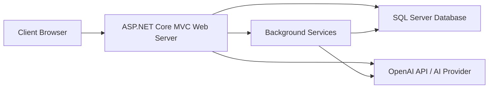
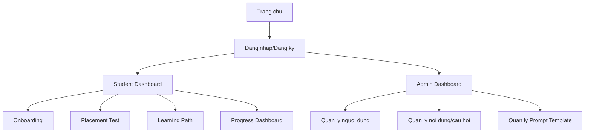

# MAU TEMPLATE AI CHO CLAUDE OPUS 4.6

## 1. Vai tro va muc tieu

Ban la Claude Opus 4.6, dong vai mot chuyen gia phan tich he thong, ky su phan mem va nguoi bien soan bao cao tot nghiep bang tieng Viet.

Muc tieu cua ban la doc ma nguon thuc te trong du an `E:\DuAnTotNghiep`, doi chieu voi prompt goc `Docs/Prompt_BaoCao_AIStudyEnglish.md`, sau do tao bao cao/tai lieu template chi tiet cho de tai:

**HE THONG HOC TIENG ANH THONG MINH - AI STUDY ENGLISH**

File ket qua can tao:

```text
Docs/BaoCao_AIStudyEnglish_Template.md
```

> [!IMPORTANT]
> Day la khung lam viec. Khong duoc bia code, schema, bang du lieu, tinh nang, hinh anh hoac file khong ton tai. Neu khong tim thay thong tin trong ma nguon, hay ghi ro: `Chua tim thay trong ma nguon hien tai`.

---

## 2. Nguyen tac bat buoc

1. Doc prompt goc truoc:

```text
Docs/Prompt_BaoCao_AIStudyEnglish.md
```

2. Chi su dung thong tin da xac minh tu file trong du an.
3. Moi noi dung lien quan den code, database, service, controller, cau hinh, hosted service hoac prompt AI phai co duong dan file nguon di kem.
4. Khong chen doan code dai qua muc can thiet. Chi trich code dai dien va tom tat y nghia.
5. Neu can hinh anh ma file chua ton tai, chen placeholder:

```md

```

6. Van phong bao cao: tieng Viet, hoc thuat, ro rang, co cau truc, phu hop bao cao do an/tot nghiep.
7. Cac muc can phan tich sau nen co block chi dan rieng cho Opus:

```md
> [!IMPORTANT] (YEU CAU OPUS 4.6)
> Hay viet them 2-3 doan phan tich sau sac ve phan nay theo van phong hoc thuat, dua tren du lieu da xac minh tu ma nguon.
```

---

## 3. Quy trinh Claude can thuc hien

### Buoc 1: Khao sat tai lieu va ma nguon

Hay doc va ghi chu cac nhom thong tin sau:

- Cau truc thu muc du an.
- File `.csproj`.
- `Program.cs` va cac cau hinh DI, middleware, authentication, background service.
- File schema database: `schema.sql` hoac bien the tuong duong.
- Thu muc/tang `Models`, `Data`, `Repositories`, `Services`, `Controllers`, `Areas`, `Views`, `wwwroot`.
- Cac file lien quan den OpenAI/API/AI prompt/background processing.

Bang ghi nhan bang chung:

| Nhom thong tin | File/thu muc da doc | Noi dung tim thay | Ghi chu |
|---|---|---|---|
| Cau truc du an | `[DUONG_DAN_FILE]` | `[OPUS_DIEN]` | `[OPUS_DIEN]` |
| Cau hinh ung dung | `[DUONG_DAN_FILE]` | `[OPUS_DIEN]` | `[OPUS_DIEN]` |
| Database/schema | `[DUONG_DAN_FILE]` | `[OPUS_DIEN]` | `[OPUS_DIEN]` |
| Service nghiep vu | `[DUONG_DAN_FILE]` | `[OPUS_DIEN]` | `[OPUS_DIEN]` |
| Controller/View | `[DUONG_DAN_FILE]` | `[OPUS_DIEN]` | `[OPUS_DIEN]` |
| AI integration | `[DUONG_DAN_FILE]` | `[OPUS_DIEN]` | `[OPUS_DIEN]` |

### Buoc 2: Lap ban do tinh nang

Xac dinh cac actor va tinh nang chinh:

| Actor | Tinh nang xac minh duoc | File lien quan | Ghi chu |
|---|---|---|---|
| Student | `[OPUS_DIEN]` | `[DUONG_DAN_FILE]` | `[OPUS_DIEN]` |
| Admin | `[OPUS_DIEN]` | `[DUONG_DAN_FILE]` | `[OPUS_DIEN]` |
| Teacher | `[OPUS_DIEN]` | `[DUONG_DAN_FILE]` | `[OPUS_DIEN]` |
| System/AI Worker | `[OPUS_DIEN]` | `[DUONG_DAN_FILE]` | `[OPUS_DIEN]` |

### Buoc 3: Tao file bao cao

Tao file `Docs/BaoCao_AIStudyEnglish_Template.md` theo khung o muc 4 ben duoi.

### Buoc 4: Tu kiem tra

Truoc khi ket thuc, kiem tra:

- Khong con noi dung bia dat.
- Cac bang database deu dua tren schema/code that.
- Cac doan code minh hoa co duong dan file.
- Placeholder duoc danh dau ro rang.
- Muc luc va so chuong muc nhat quan.

---

## 4. Khung bao cao can tao

# BAO CAO DU AN

## HE THONG HOC TIENG ANH THONG MINH - AI STUDY ENGLISH

**Thanh vien thuc hien:** Nong Thi Thao Nguyen  
**Cong nghe su dung:** ASP.NET Core MVC, SQL Server, OpenAI API  
**Duong dan du an:** `E:\DuAnTotNghiep`  
**File nguon chinh:** `Docs/Prompt_BaoCao_AIStudyEnglish.md`

---

# CHUONG 1: GIOI THIEU DU AN

## 1.1. Gioi thieu du an

Noi dung can viet:

- Ly do chon de tai.
- Boi canh ung dung AI tao sinh trong giao duc.
- Nhu cau ca nhan hoa lo trinh hoc tieng Anh.
- Gia tri cua he thong AI Study English.

> [!IMPORTANT] (YEU CAU OPUS 4.6)
> Hay viet phan nay thanh 2-4 doan van hoc thuat, gan voi boi canh thuc te cua ung dung va cac tinh nang da xac minh tu ma nguon.

## 1.2. Yeu cau he thong

### 1.2.1. Yeu cau chuc nang

| Actor | Ma yeu cau | Ten yeu cau | Mo ta | Bang chung ma nguon |
|---|---|---|---|---|
| Student | FR-STU-01 | `[OPUS_DIEN]` | `[OPUS_DIEN]` | `[DUONG_DAN_FILE]` |
| Admin | FR-ADM-01 | `[OPUS_DIEN]` | `[OPUS_DIEN]` | `[DUONG_DAN_FILE]` |
| Teacher | FR-TEA-01 | `[OPUS_DIEN]` | `[OPUS_DIEN]` | `[DUONG_DAN_FILE]` |
| System/AI | FR-AI-01 | `[OPUS_DIEN]` | `[OPUS_DIEN]` | `[DUONG_DAN_FILE]` |

### 1.2.2. Yeu cau phi chuc nang

| Nhom yeu cau | Mo ta | Cach du an dap ung | Bang chung |
|---|---|---|---|
| Bao mat | `[OPUS_DIEN]` | `[OPUS_DIEN]` | `[DUONG_DAN_FILE]` |
| Hieu nang | `[OPUS_DIEN]` | `[OPUS_DIEN]` | `[DUONG_DAN_FILE]` |
| Mo rong | `[OPUS_DIEN]` | `[OPUS_DIEN]` | `[DUONG_DAN_FILE]` |
| Bao tri | `[OPUS_DIEN]` | `[OPUS_DIEN]` | `[DUONG_DAN_FILE]` |

## 1.3. Pham vi du an

- Pham vi da thuc hien: `[OPUS_DIEN]`
- Pham vi chua thuc hien: `[OPUS_DIEN]`
- Gioi han ky thuat: `[OPUS_DIEN]`

## 1.4. Ke hoach du an

Lap bang M1 den M17 dua tren tai lieu hoac file co san trong du an. Neu khong tim thay file nguon, ghi ro chua tim thay.

| Module | Ten module | Noi dung cong viec | Trang thai | Bang chung |
|---|---|---|---|---|
| M1 | `[OPUS_DIEN]` | `[OPUS_DIEN]` | `[OPUS_DIEN]` | `[DUONG_DAN_FILE]` |
| M2 | `[OPUS_DIEN]` | `[OPUS_DIEN]` | `[OPUS_DIEN]` | `[DUONG_DAN_FILE]` |
| M3 | `[OPUS_DIEN]` | `[OPUS_DIEN]` | `[OPUS_DIEN]` | `[DUONG_DAN_FILE]` |
| ... | ... | ... | ... | ... |
| M17 | `[OPUS_DIEN]` | `[OPUS_DIEN]` | `[OPUS_DIEN]` | `[DUONG_DAN_FILE]` |

---

# CHUONG 2: PHAN TICH YEU CAU HE THONG

## 2.1. So do Use Case

Noi dung can co:

- Use Case tong quat.
- Use Case phan he Student.
- Use Case phan he Admin.
- Use Case phan he AI Integration.

Neu co file anh:

```md

```

Neu chua co file anh, dung placeholder:

```md

```

## 2.2. Dac ta yeu cau he thong SRS

Viet dac ta cho cac Use Case cot loi duoi day. Chi dien thong tin da co can cu tu code/tai lieu.

### UC-ONB: Khao sat ban dau

| Thanh phan | Noi dung |
|---|---|
| Ma Use Case | UC-ONB |
| Ten Use Case | Khao sat ban dau |
| Tac nhan | Student |
| Muc tieu | `[OPUS_DIEN]` |
| Tien dieu kien | `[OPUS_DIEN]` |
| Luong chinh | `[OPUS_DIEN]` |
| Luong thay the/ngoai le | `[OPUS_DIEN]` |
| Hau dieu kien | `[OPUS_DIEN]` |
| Bang chung | `[DUONG_DAN_FILE]` |

### UC-TST: Lam bai kiem tra xep lop

| Thanh phan | Noi dung |
|---|---|
| Ma Use Case | UC-TST |
| Ten Use Case | Lam bai kiem tra xep lop |
| Tac nhan | Student |
| Muc tieu | `[OPUS_DIEN]` |
| Tien dieu kien | `[OPUS_DIEN]` |
| Luong chinh | `[OPUS_DIEN]` |
| Luong thay the/ngoai le | `[OPUS_DIEN]` |
| Hau dieu kien | `[OPUS_DIEN]` |
| Bang chung | `[DUONG_DAN_FILE]` |

### UC-ANL: Xem phan tich nang luc AI

| Thanh phan | Noi dung |
|---|---|
| Ma Use Case | UC-ANL |
| Ten Use Case | Xem phan tich nang luc AI |
| Tac nhan | Student |
| Muc tieu | `[OPUS_DIEN]` |
| Tien dieu kien | `[OPUS_DIEN]` |
| Luong chinh | `[OPUS_DIEN]` |
| Luong thay the/ngoai le | `[OPUS_DIEN]` |
| Hau dieu kien | `[OPUS_DIEN]` |
| Bang chung | `[DUONG_DAN_FILE]` |

### UC-PTH: Hoc theo lo trinh ca nhan hoa

| Thanh phan | Noi dung |
|---|---|
| Ma Use Case | UC-PTH |
| Ten Use Case | Xem va hoc theo lo trinh hoc tap ca nhan hoa |
| Tac nhan | Student |
| Muc tieu | `[OPUS_DIEN]` |
| Tien dieu kien | `[OPUS_DIEN]` |
| Luong chinh | `[OPUS_DIEN]` |
| Luong thay the/ngoai le | `[OPUS_DIEN]` |
| Hau dieu kien | `[OPUS_DIEN]` |
| Bang chung | `[DUONG_DAN_FILE]` |

### UC-GEN: Sinh cau hoi tu dong bang AI

| Thanh phan | Noi dung |
|---|---|
| Ma Use Case | UC-GEN |
| Ten Use Case | Sinh cau hoi tu dong bang AI |
| Tac nhan | Admin/System AI |
| Muc tieu | `[OPUS_DIEN]` |
| Tien dieu kien | `[OPUS_DIEN]` |
| Luong chinh | `[OPUS_DIEN]` |
| Luong thay the/ngoai le | `[OPUS_DIEN]` |
| Hau dieu kien | `[OPUS_DIEN]` |
| Bang chung | `[DUONG_DAN_FILE]` |

## 2.3. So do trien khai

Mo ta kien truc Client - Web Server - Database Server - AI Provider.

Neu co the, dung Mermaid:



> [!IMPORTANT] (YEU CAU OPUS 4.6)
> Hay viet them phan giai thich kien truc trien khai dua tren cau hinh that trong `Program.cs`, file cau hinh va service da tim thay.

---

# CHUONG 3: THIET KE UNG DUNG

## 3.1. Mo hinh cong nghe va kien truc phan tang

Can mo ta cac tang:

- Presentation Layer: Views/Razor/Static assets.
- Controller Layer: Xu ly request/response.
- Service Layer: Nghiep vu ung dung.
- Repository/Data Access Layer: Truy cap du lieu.
- Database Layer: SQL Server/schema.
- AI Integration Layer: Goi OpenAI/API va xu ly bat dong bo.

Bang tong hop:

| Tang | Vai tro | File/thu muc dai dien | Ghi chu |
|---|---|---|---|
| Presentation | `[OPUS_DIEN]` | `[DUONG_DAN_FILE]` | `[OPUS_DIEN]` |
| Controller | `[OPUS_DIEN]` | `[DUONG_DAN_FILE]` | `[OPUS_DIEN]` |
| Service | `[OPUS_DIEN]` | `[DUONG_DAN_FILE]` | `[OPUS_DIEN]` |
| Repository/Data | `[OPUS_DIEN]` | `[DUONG_DAN_FILE]` | `[OPUS_DIEN]` |
| AI Integration | `[OPUS_DIEN]` | `[DUONG_DAN_FILE]` | `[OPUS_DIEN]` |

## 3.2. Thuc the va co so du lieu

### 3.2.1. So do ERD

Neu co file:

```md

```

Neu khong co, tao mo ta quan he bang Mermaid hoac placeholder.

### 3.2.2. Danh sach bang du lieu chinh

Can kiem tra cac bang sau neu ton tai:

- `users`
- `roles`
- `student_learning_profiles`
- `placement_tests`
- `placement_test_questions`
- `test_attempts`
- `student_learning_paths`
- `learning_path_nodes`
- `ai_generated_contents`
- `ai_prompt_templates`

### 3.2.3. Tu dien du lieu

Lap bang cho tung table theo mau:

#### Bang: `[TEN_BANG]`

Mo ta: `[OPUS_DIEN]`  
Nguon: `[DUONG_DAN_FILE]`

| Ten cot | Kieu du lieu | Khoa | Nullable | Mo ta y nghia |
|---|---|---|---|---|
| `[OPUS_DIEN]` | `[OPUS_DIEN]` | `[PK/FK/UNIQUE/INDEX/None]` | `[Yes/No]` | `[OPUS_DIEN]` |

## 3.3. Thiet ke giao dien

Can co:

- Sitemap Student.
- Sitemap Admin.
- Mo ta man hinh Dashboard.
- Mo ta man hinh lo trinh hoc tap dang cay/bai hoc.
- Mo ta man hinh quan tri cau hoi/noi dung AI neu co.

Mau sitemap:



> [!IMPORTANT] (YEU CAU OPUS 4.6)
> Hay dieu chinh sitemap theo route/controller/view that su trong du an. Neu mot man hinh chua co, ghi ro la de xuat/placeholder, khong viet nhu tinh nang da hoan thanh.

---

# CHUONG 4: THUC HIEN DU AN

## 4.1. Cau truc thu muc

Chen cau truc thu muc rut gon tu du an thuc te:

```text
E:\DuAnTotNghiep
├── [OPUS_DIEN]
├── [OPUS_DIEN]
└── [OPUS_DIEN]
```

Sau do giai thich vai tro cac thu muc quan trong:

| Thu muc/file | Vai tro |
|---|---|
| `[DUONG_DAN]` | `[OPUS_DIEN]` |

## 4.2. Code SQL tao bang

Chi trich cac doan SQL that tu file schema. Uu tien cac bang:

- `users`
- `student_learning_profiles`
- `student_learning_paths`
- `learning_path_nodes`
- `ai_generated_contents`

Mau trinh bay:

### Bang `[TEN_BANG]`

Nguon: `[DUONG_DAN_FILE]`

```sql
-- OPUS_DIEN: trich SQL tao bang that tu schema
```

Phan tich:

- Muc dich cua bang: `[OPUS_DIEN]`
- Cac cot quan trong: `[OPUS_DIEN]`
- Quan he voi bang khac: `[OPUS_DIEN]`

## 4.3. Code C# minh hoa

### 4.3.1. Repository/Unit of Work neu co

Nguon: `[DUONG_DAN_FILE]`

```csharp
// OPUS_DIEN: trich interface/lop repository that, khong bia
```

Giai thich:

- Vai tro: `[OPUS_DIEN]`
- Cach service/controller su dung: `[OPUS_DIEN]`

### 4.3.2. Service nghiep vu

Uu tien cac service lien quan den:

- Placement Test.
- Learning Path.
- Competency Analysis.
- AI generation.

Nguon: `[DUONG_DAN_FILE]`

```csharp
// OPUS_DIEN: trich code service that
```

### 4.3.3. Controller xu ly request

Nguon: `[DUONG_DAN_FILE]`

```csharp
// OPUS_DIEN: trich action controller that
```

## 4.4. Tich hop AI

Can lam ro:

- Cau hinh OpenAI/API trong `Program.cs` hoac file config.
- Cach doc API key/env.
- Service goi AI.
- Hosted service/background queue neu co.
- Prompt template that neu co luu trong database/file.
- Cach he thong xu ly ket qua AI.

Bang tong hop:

| Thanh phan AI | Vai tro | File nguon | Ghi chu |
|---|---|---|---|
| `[OPUS_DIEN]` | `[OPUS_DIEN]` | `[DUONG_DAN_FILE]` | `[OPUS_DIEN]` |

> [!IMPORTANT] (YEU CAU OPUS 4.6)
> Hay phan tich ro luong du lieu tu luc hoc vien nop bai test den luc AI phan tich nang luc va tao lo trinh hoc tap. Can dua tren service, controller va database that.

---

# CHUONG 5: KIEM THU PHAN MEM

## 5.1. Phuong phap kiem thu

Mo ta ngan gon:

- Kiem thu chuc nang.
- Kiem thu luong nghiep vu.
- Kiem thu du lieu dau vao khong hop le.
- Kiem thu tich hop AI neu co.

## 5.2. Test case phan he tai khoan

| ID | Ten ca kiem thu | Cac buoc thuc hien | Du lieu dau vao | Ket qua mong doi | Ket qua thuc te | Ghi chu |
|---|---|---|---|---|---|---|
| TC-ACC-01 | Dang nhap thanh cong | `[OPUS_DIEN]` | `[OPUS_DIEN]` | `[OPUS_DIEN]` | `[Dat/Khong dat/Chua chay]` | `[OPUS_DIEN]` |
| TC-ACC-02 | Dang nhap that bai | `[OPUS_DIEN]` | `[OPUS_DIEN]` | `[OPUS_DIEN]` | `[Dat/Khong dat/Chua chay]` | `[OPUS_DIEN]` |
| TC-ACC-03 | Dang ky email trung lap | `[OPUS_DIEN]` | `[OPUS_DIEN]` | `[OPUS_DIEN]` | `[Dat/Khong dat/Chua chay]` | `[OPUS_DIEN]` |

## 5.3. Test case phan he Placement Test

| ID | Ten ca kiem thu | Cac buoc thuc hien | Du lieu dau vao | Ket qua mong doi | Ket qua thuc te | Ghi chu |
|---|---|---|---|---|---|---|
| TC-TST-01 | Lam bai va nop bai dung han | `[OPUS_DIEN]` | `[OPUS_DIEN]` | `[OPUS_DIEN]` | `[Dat/Khong dat/Chua chay]` | `[OPUS_DIEN]` |
| TC-TST-02 | Tu dong nop khi het gio | `[OPUS_DIEN]` | `[OPUS_DIEN]` | `[OPUS_DIEN]` | `[Dat/Khong dat/Chua chay]` | `[OPUS_DIEN]` |
| TC-TST-03 | Tra loi thieu cau hoi | `[OPUS_DIEN]` | `[OPUS_DIEN]` | `[OPUS_DIEN]` | `[Dat/Khong dat/Chua chay]` | `[OPUS_DIEN]` |

## 5.4. Test case phan he sinh lo trinh bang AI

| ID | Ten ca kiem thu | Cac buoc thuc hien | Du lieu dau vao | Ket qua mong doi | Ket qua thuc te | Ghi chu |
|---|---|---|---|---|---|---|
| TC-AI-01 | Sinh lo trinh sau placement test | `[OPUS_DIEN]` | `[OPUS_DIEN]` | `[OPUS_DIEN]` | `[Dat/Khong dat/Chua chay]` | `[OPUS_DIEN]` |
| TC-AI-02 | Tai cau truc lo trinh khi doi muc tieu | `[OPUS_DIEN]` | `[OPUS_DIEN]` | `[OPUS_DIEN]` | `[Dat/Khong dat/Chua chay]` | `[OPUS_DIEN]` |
| TC-AI-03 | Xu ly loi khi AI provider loi | `[OPUS_DIEN]` | `[OPUS_DIEN]` | `[OPUS_DIEN]` | `[Dat/Khong dat/Chua chay]` | `[OPUS_DIEN]` |

---

# CHUONG 6: KET LUAN

## 6.1. Ket qua dat duoc

Noi dung can viet:

- Cac module da hoan thanh.
- Cac tinh nang noi bat.
- Gia tri cua he thong voi hoc vien/quan tri vien/giao vien.
- Vai tro cua AI trong viec ca nhan hoa hoc tap.

## 6.2. Han che

Co the phan tich:

- Phu thuoc API AI ben ngoai neu co.
- Chi phi token/API khi mo rong.
- Do tre khi xu ly tac vu AI nang.
- Cac gioi han hien co trong code/du lieu neu tim thay.

## 6.3. Huong phat trien

Goi y neu phu hop voi code hien tai:

- Tich hop mo hinh AI ma nguon mo/self-hosted.
- Bo sung AI Tutor Voice Chat.
- Mo rong he thong bao cao hoc tap.
- Cai thien learning analytics.
- Cai thien quan tri prompt template va danh gia chat luong noi dung AI.

> [!IMPORTANT] (YEU CAU OPUS 4.6)
> Hay viet ket luan co tinh tong ket hoc thuat, khong phong dai qua muc. Neu mot huong phat trien chua co nen tang trong code hien tai, ghi la dinh huong de xuat.

---

# PHU LUC A: BAN DO BANG CHUNG

Lap bang tong hop cac file da su dung khi viet bao cao.

| STT | File/thu muc | Noi dung su dung trong bao cao | Chuong/muc lien quan |
|---|---|---|---|
| 1 | `[DUONG_DAN_FILE]` | `[OPUS_DIEN]` | `[OPUS_DIEN]` |

---

# PHU LUC B: CAC PLACEHOLDER CAN XU LY

Trong qua trinh viet, neu con placeholder, tong hop lai o day:

| Placeholder | Vi tri | Ly do chua hoan thanh | Viec can lam tiep |
|---|---|---|---|
| `[OPUS_DIEN]` | `[OPUS_DIEN]` | `[OPUS_DIEN]` | `[OPUS_DIEN]` |

---

## 5. Checklist hoan thanh cho Claude Opus 4.6

Truoc khi ket thuc, hay dam bao:

- [ ] Da tao file `Docs/BaoCao_AIStudyEnglish_Template.md`.
- [ ] Da doc `Docs/Prompt_BaoCao_AIStudyEnglish.md`.
- [ ] Da doc schema/database that neu co.
- [ ] Da doc `Program.cs` neu co.
- [ ] Da xac minh repository/service/controller that.
- [ ] Khong bia code, bang du lieu hoac tinh nang.
- [ ] Moi doan code trich dan deu co duong dan file.
- [ ] Moi hinh anh chua co file deu duoc danh dau `CAN_CHEN_HINH`.
- [ ] Cac placeholder con lai duoc tong hop trong Phu luc B.
- [ ] Bao cao dung cau truc Chuong 1 den Chuong 6.
